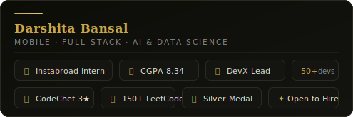
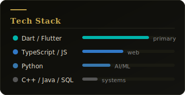

# Darshita Bansal

**Mobile App Developer Intern · Full-Stack · AI & Data Science**

---

### 👩‍💻 About Me

B.Tech **AI & Data Science** student at **IIIT Raichur** (CGPA **8.34**), currently interning as a **Mobile App Developer at Instabroad Medical** — building a cross-platform Flutter app from architecture to deployment. I specialise in full-stack development, distributed systems, and Generative AI integrations.

- 📱 **Mobile App Developer Intern** @ Instabroad Medical — Flutter, Firebase (Auth, Firestore, Cloud Functions), iOS & Android
- 🌐 **Website Team Member** @ IIIT Raichur — achieved **40% faster payload** delivery & **35% lower API latency**
- 🛠 **Coordinator** @ DevX Club — CI/CD pipelines, system design mentorship for **50+ developers**
- 🏓 **Silver Medalist** — Inter-IIIT Sports Meet 2024-25 (Girls Table Tennis Captain)
- 📍 Raichur, Karnataka · Available for Opportunities

---

### 🚀 Featured Projects

#### [CrowdBuddy — Real-Time Crowd Management Platform](https://github.com/darshita2110/Crowd_Management_System)
> `Flutter` `Firebase/Firestore` `Python` `WebSockets` `REST APIs` `Provider/Bloc`

- Event-driven Firestore architecture sustaining **1,000+ concurrent sessions** with low-latency emergency alerts
- Thread-safe REST API polling with **O(log n) priority queues** for non-blocking alert dispatch
- Python microservices for real-time crowd analytics streamed via WebSockets to Flutter frontend

#### [CultureConnect — AI-Powered Heritage Travel Ecosystem](https://github.com/darshita2110/CultureConnect)
> `React/Next.js` `FastAPI` `Gemini LLM API` `MongoDB` `SQL` `Google Maps API`

- FastAPI + Gemini LLM backend for agentic itinerary generation with personalised AI workflows
- MongoDB + SQL hybrid with **O(1) geospatial lookups** via optimised indexing & Google Maps integration
- Offline-first data-caching on Next.js cutting redundant API calls by **~60%**

---

### 🧰 Tech Stack

**Languages**

**Frontend & Mobile**

**Backend & Cloud**

**Databases**

**AI & Dev**

---

### 📊 GitHub Stats

---

### 🏆 Achievements

| | |
|---|---|
| 🏅 **CodeChef 3★** | Max rating **1609** · **300+ problems** solved · Silver Problem-Solver badge — [`darshita_b21`](https://www.codechef.com/users/darshita_b21) |
| 💻 **LeetCode** | **150+ problems** across DP, binary search & graphs — [`darshita_bansal21`](https://leetcode.com/darshita_bansal21) |
| 🥈 **Silver Medal** | Inter-IIIT Sports Meet 2024-25 — Girls Table Tennis Captain |
| 🎖️ **NSO Secretary** | Organised Mass Run for **300+ students**; secured institutional sports funding |

---

*"Turning complex systems into elegant, user-centric solutions — one commit at a time."*

